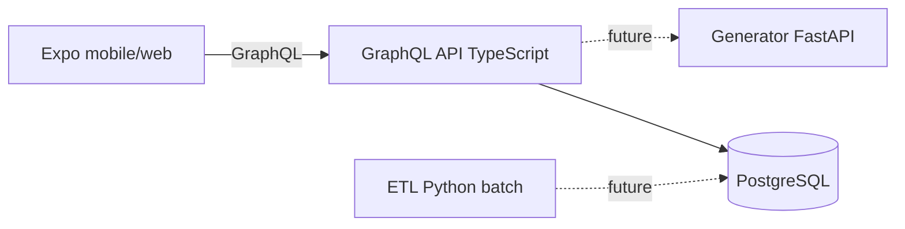

# RetroCart Architecture

## Overview

RetroCart is a personal retro game collection curator. Users define console preferences, genre weights, and SD card storage budget; the system generates an optimized ROM catalog and supports iterative refinement (pin, swap, exclude, manual add).

## Service topology (scaffold)

| Service | Stack | Responsibility |
|---------|-------|----------------|
| Mobile + Web | React Native, Expo | Client UI |
| GraphQL API | TypeScript, Yoga, Pothos | Auth (future), catalog CRUD, game search, delegate generation |
| Generator | Python, FastAPI | Scoring, bin-packing, pin/swap logic (internal only) |
| ETL | Python | No-Intro dat ingestion → master catalog |
| Database | PostgreSQL | Master catalog + user domain |

## Data model

- **Master catalog** (read-only to clients): `game`, `rom_release`, `console`, `genre`, junction tables
- **User domain**: `app_user`, `catalog`, `catalog_entry`, `user_signal`

`catalog_entry` references `rom_release` (the file on the SD card), not `game`.

Migrations: [`db/sql/`](../db/sql/).

## Auth (deferred)

Scaffold uses a fixed dev user (`DEV_USER_ID` / `X-Dev-User-Id`). Replace with Clerk or Supabase Auth before any production deployment.

## Ports (local dev)

| Service | Port |
|---------|------|
| Postgres | 5434 |
| GraphQL | 4000 |
| Generator | 8001 |

## Generator integration (future)

The GraphQL API will call `POST /internal/generate` on the generator service. The scaffold exposes the endpoint but returns HTTP 501.

See [OPEN_QUESTIONS.md](./OPEN_QUESTIONS.md) for unresolved product decisions.
