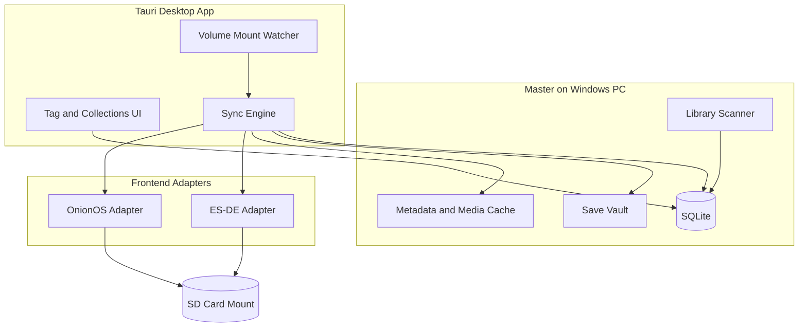
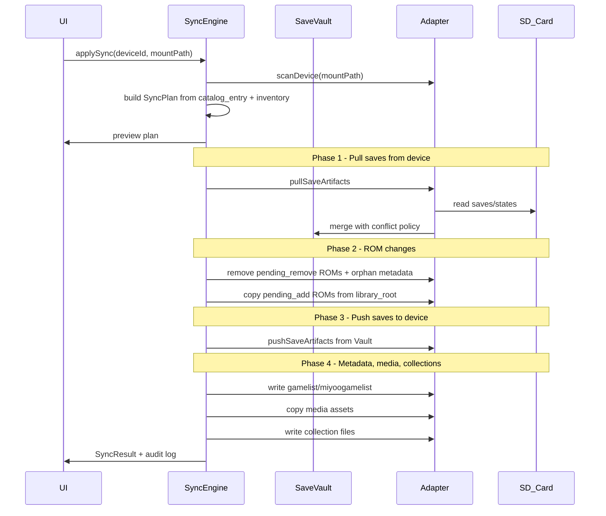
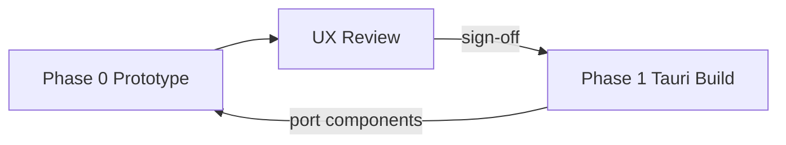

# Multi-Device Library Management Plan

> **Status:** Approved direction (June 2026)  
> **Summary:** Desktop-first library management on Windows — Phase 0 UI prototype, then master library indexing, device tagging, and SD sync (ROMs, saves, metadata, collections) via ES-DE and OnionOS adapters.

## Implementation checklist

- [ ] **Phase 0** — Interactive frontend prototype (Vite + React, mock data): all key screens, desktop layout, no backend/Tauri
- [ ] Validate prototype flows (tagging, sync preview, collections, device setup); extract component/layout decisions before build
- [ ] Add V5/V6 migrations: device, library_root, library_item, save_artifact, sync_run, platform_map; link catalog to device
- [ ] Create `packages/sync-core` with adapter interface, platform map seed, conflict resolver, gamelist writers
- [ ] Implement OnionOS adapter: ROM ops, miyoogamelist, saves/states, favourite.json
- [ ] **Phase 1** — Scaffold `apps/desktop` (Tauri + React + SQLite): port validated prototype UI, wire real sync engine
- [ ] Implement ES-DE adapter: gamelist.xml, downloaded_media, custom collection cfg + es_settings registration
- [ ] Update ARCHITECTURE.md and add docs/SYNC.md with frontend path reference and conflict policy

---

## Product shift

| Original direction | New direction |
|---|---|
| Generate a curated subset from preferences + storage budget | Manage a **master library** on disk and **tag** ROMs per device |
| Single SD card catalog as the artifact | **Device profiles** with sync-on-mount |
| Mobile-first Expo client | **Desktop-primary Tauri app on Windows** |

The generator/curation work is not discarded — it becomes a **recommendation engine** for tagging games onto a device (`"fill Miyoo to 128GB with these pins"`). The sync engine is the new core deliverable.

### Platform target

| Role | Platform |
|---|---|
| **Primary (master library + sync UI)** | Windows 10/11 x64 |
| Handheld SD cards | exFAT/FAT32 removable volumes (OnionOS, ES-DE portable setups) |
| Secondary desktop builds | macOS, Linux — same Tauri codebase, later phase |

Development may occur on macOS (current dev machine), but **Phase 1 exit criteria and manual QA target Windows**. Use cross-platform path APIs throughout; no macOS-only assumptions in sync logic.



---

## What each frontend needs (adapter contract)

Both adapters implement the same interface in a new shared package [`packages/sync-core`](../packages/sync-core):

```typescript
interface FrontendAdapter {
  detect(mountPath: string): AdapterMatch | null;
  scanDevice(mountPath: string): DeviceInventory;      // what's on SD now
  planSync(intent: SyncIntent, inventory: DeviceInventory): SyncPlan;
  applyRomOps(plan: SyncPlan): SyncResult;
  applyMetadataOps(plan: SyncPlan): SyncResult;
  applySaveOps(plan: SyncPlan): SyncResult;            // pull + push
  applyCollectionOps(plan: SyncPlan): SyncResult;
}
```

### ES-DE adapter paths

| Asset | Location on mount |
|---|---|
| ROMs | `{mount}/ROMs/{es_system}/` |
| Gamelists | `{mount}/ES-DE/gamelists/{es_system}/gamelist.xml` |
| Media | `{mount}/ES-DE/downloaded_media/{es_system}/{mediatype}/{rom_basename}.ext` |
| Collections | `{mount}/ES-DE/collections/custom-{name}.cfg` (one ROM path per line, `%ROMPATH%`-relative) |
| Collection enablement | Must register in `es_settings.xml` (adapter reads/writes known keys) |
| Saves/states | RetroArch/libretro paths under device (typically `RetroArch/.retroarch/saves/` and `.../states/` on SD setups) — mapped per system via platform table |

ES-DE matches media by **ROM filename**, not gamelist image tags — RetroCart should store media keyed to `library_item.filename_stem`.

### OnionOS adapter paths

| Asset | Location on mount |
|---|---|
| ROMs | `{mount}/Roms/{ONION_CODE}/` (case-sensitive, e.g. `FC`, `SFC`, `PS`) |
| Metadata | `{mount}/Roms/{ONION_CODE}/miyoogamelist.xml` |
| Saves | `{mount}/Saves/CurrentProfile/saves/{core_name}/` |
| Save states | `{mount}/Saves/CurrentProfile/states/{core_name}/` |
| Favorites (limited collections) | `{mount}/Saves/CurrentProfile/favourite.json` (JSON-per-line) |

**Onion collection limitation:** Onion has no arbitrary custom collections — only Favorites. RetroCart collections on Onion devices map to:

- **Primary:** `favourite.json` entries for a designated "Favorites" collection
- **Optional later:** one-level-deep ROM subfolders (`Roms/GB/MyCollection/`) as physical grouping

ES-DE gets full multi-collection support via `.cfg` files.

---

## Data model evolution

Extend existing schema in [`db/sql/`](../db/sql/) (Flyway for dev; SQLite migrations for desktop). Reuse concepts from [`V3__user_domain.sql`](../db/sql/V3__user_domain.sql) rather than starting over.

### Repurpose `catalog` → device library intent

- Add `device` table: name, **short_name** (user-set nickname, e.g. `MM+`, `RP6` — used as the compact column header in the library table instead of full device names), `frontend_type` (`esde` | `onion`), storage budget, optional hardware label, `mount_label_hint` (Windows volume label, e.g. `MIYOO`), optional last-seen mount path (informational only — not used as identity)
- Device creation/edit form must prompt for `short_name` (default to first 4 chars of name if left blank); library table column headers use `short_name` with full name as a hover tooltip
- Add `catalog.device_id` FK — each catalog **is** the intended library for one device (existing `catalog_entry` = tagged ROMs)
- Add `catalog_entry.sync_status`: `pending_add` | `synced` | `pending_remove` | `conflict`

### New master-library tables

| Table | Purpose |
|---|---|
| `library_root` | User-configured master ROM directories (absolute path, enabled) |
| `library_item` | Indexed file: root_id, relative_path, sha1/crc, size, mtime, optional `rom_release_id` FK |
| `library_item_metadata` | Canonical scraped metadata (title, desc, year, genres) — scraped **once** on master |
| `media_asset` | boxart, screenshot, etc. linked to library_item |
| `save_artifact` | Canonical copy in Save Vault: library_item_id, kind (`sram`/`state`), core_name, filename, hash, mtime, source_device_id |
| `collection` + `collection_item` | User collections (cross-device, device-agnostic) |
| `device_collection` | Per-device projection rules (e.g. ES-DE cfg name, Onion favorites flag) |
| `sync_run` + `sync_run_item` | Audit log: action, path, bytes, conflict details |
| `platform_map` | Maps internal console → ES-DE folder, Onion folder, libretro core name(s), save path strategy |

Link `catalog_entry.rom_release_id` to `library_item` via hash match during scan (existing `rom_release.rom_hash` unique constraint is the join key).

### Save conflict policy

On each save/state file pair (master vault vs device):

1. Compare mtime; if equal, compare hash — skip if identical
2. If different: **newer wins** as the canonical copy
3. **Rename the older file** to `{basename}.retrocart-conflict-{iso8601}{ext}` on both sides (never silent overwrite)
4. Write a `sync_run_item` with `action: save_conflict` and both paths/hashes

---

## Desktop app architecture

Add [`apps/desktop`](../apps/desktop) — **Tauri 2 + React + TypeScript**, **Windows-first** (macOS/Linux supported later via same codebase).

| Layer | Responsibility |
|---|---|
| Tauri Rust commands | File copy/delete, hashing (parallel), drive/volume detection, safe rename |
| TypeScript sync orchestrator | Adapter selection, plan/apply, DB access |
| React UI | Master library browser, device tagging, collection editor, sync preview/apply |
| Local SQLite | Embedded DB at `%APPDATA%\RetroCart\retrocart.db` (schema ported from Postgres migrations; no Docker required for normal use) |

**Why Tauri over Electron:** native file I/O performance for large libraries, lower footprint, good cross-platform Rust file APIs.

**Windows path conventions:**

- Master library: user-chosen folders (e.g. `D:\ROMs\`, `C:\Users\{user}\Documents\RetroCart\library\`)
- SD card mount: removable drive letter (e.g. `E:\`) — path stored internally via `std::path` / `path.join()`; never hardcode separators
- Save Vault: `%APPDATA%\RetroCart\vault\` (canonical saves/states pulled from devices)
- Metadata/media cache: `%APPDATA%\RetroCart\media\`
- All adapters receive normalized absolute paths; adapter writers emit paths appropriate to the target frontend (Onion uses `/mnt/SDCARD/...` only inside JSON/XML on the card, not on the PC)

**Existing stack disposition:**

- Keep [`apps/api`](../apps/api) + Postgres for dev/integration tests and future optional cloud sync
- [`apps/mobile`](../apps/mobile) deferred — desktop is primary; mobile can become a read-only remote later
- [`services/etl`](../services/etl) unchanged — still populates `rom_release` reference data for hash matching
- [`services/generator`](../services/generator) later feeds `catalog_entry` suggestions per device budget

### Key UI flows

1. **Setup:** Add master `library_root`(s) → initial scan (background, resumable)
2. **Devices:** Create device profile (name, frontend, storage budget) → link to catalog
3. **Tagging:** Browse master library; toggle "on Miyoo" / "on ES-DE deck"; bulk by collection or filter
4. **Collections:** Create/edit collections; assign subset to one or more devices
5. **Sync:** SD mounted → auto-detect device → show diff preview (adds, removes, save pulls/pushes, conflicts) → Apply
6. **Post-sync:** Mark entries `synced`; surface conflict folder locations

### Mount detection (Windows-first)

SD cards on Windows appear as removable drive letters (`E:\`, `F:\`, etc.) — letter assignment is **not stable**, so detection must fingerprint content, not assume a fixed letter.

**Primary (Windows):**

- Poll or subscribe to volume arrival via `WM_DEVICECHANGE` / `RegisterDeviceNotification` in Tauri Rust layer (or `winapi`/`windows` crate)
- On new removable volume: enumerate drive letters with `GetDriveType` == `DRIVE_REMOVABLE`
- Fingerprint mount root:
  - **OnionOS:** `.tmp_update/` + `Roms/` present
  - **ES-DE handheld/portable SD:** `ES-DE/` + `ROMs/` present (or `RetroArch/` + `ROMs/` for Batocera-like layouts — out of scope v1)
- Match fingerprint → bound `device` profile; if ambiguous, prompt user to pick device
- Optional: bind by volume label (e.g. SD formatted as `MIYOO`) stored in `device.mount_label_hint`

**Fallback (all platforms):** manual drive/folder picker in UI — required for Phase 1 MVP regardless of auto-detect.

**Secondary (later):** macOS `/Volumes/*` via `notify`; Linux `/media/{user}/*` and `/run/media/{user}/*`.

---

## Sync algorithm (apply order)



**ROM removal safety:** Never delete from master — only remove from SD. Optional "archive" folder on SD (`ES-DE/collections/CLEANUP`-style) before delete for first release.

**Metadata scrape once:** Use ScreenScraper / SteamGridDB / local cache on master ([OPEN_QUESTIONS.md](./OPEN_QUESTIONS.md) genre source still applies). Device sync copies pre-built artifacts — no per-device scraping.

---

## Platform mapping (critical shared asset)

Ship a seed [`platform_map.json`](../packages/sync-core/platform_map.json) covering initial consoles, e.g.:

| Console | ES-DE folder | Onion folder | Save core (Onion) |
|---|---|---|---|
| NES | `nes` | `FC` | `FCEUmm` |
| SNES | `snes` | `SFC` | `Snes9x` |
| GBA | `gba` | `GBA` | `mGBA` |
| PS1 | `psx` | `PS` | `PCSX-ReARMed` |

User-overridable per device for edge cases (alternative cores, folder renames).

Reference: Igir's `{onion}` token mapping — [Igir OnionOS docs](https://igir.io/usage/handheld/onionos/).

---

## Phased delivery

### Phase 0 — Frontend prototype (before any backend/sync build)

Build an **interactive UI prototype** to validate layout, navigation, and workflows before committing to Tauri, SQLite, or sync adapters. Throwaway-friendly but structured so winning patterns can be ported into the real app.

**Location:** [`apps/prototype`](../apps/prototype) — Vite + React + TypeScript (runs in browser, no Tauri).

**Mock data layer:** static JSON fixtures in [`apps/prototype/src/fixtures/`](../apps/prototype/src/fixtures/) simulating:

- ~200 master library items across 6–8 consoles (with boxart placeholders)
- 2 device profiles (Miyoo / OnionOS, RG35XX / ES-DE)
- Tag states (`synced`, `pending_add`, `pending_remove`, `conflict`)
- A sample `SyncPlan` with ROM adds/removes, save pulls/pushes, and renamed conflict files
- 3–4 user collections with cross-device assignment

**Screens to prototype (all clickable, stateful via local React state):**

| Screen | Purpose |
|---|---|
| **Onboarding** | Add library root(s), first scan progress (simulated) |
| **Library browser** | Filter by console/genre/search; bulk select; per-row device tag toggles |
| **Device detail** | Storage budget bar, tagged count, pending changes summary |
| **Collections** | Create/edit collection; assign to devices; drag or checkbox add |
| **Sync hub** | Drive picker (mock `E:\`), detected device banner, **sync diff preview** (the critical screen) |
| **Sync diff preview** | Tabbed: ROMs to add/remove, saves in/out, metadata/media, conflicts — with Apply/Cancel |
| **Sync result** | Post-sync audit log, conflict file paths, "eject safely" hint |
| **Settings** | Library roots, conflict policy display, platform map overrides (read-only v0) |

**Layout constraints (desktop-first, Windows):**

- Minimum viewport **1280×720**; primary layout **1440×900**
- Left sidebar: Library · Devices · Collections · Sync
- Dense data table for library (sortable columns: title, console, size, device tags, sync status)
- Sync preview as a full-width modal or dedicated page — this is the highest-risk UX and gets the most prototype time

**Explicitly out of scope for prototype:**

- Real file I/O, drive detection, hashing, SQLite, GraphQL, Tauri
- Real scraping or media download
- Persistence beyond `localStorage` (optional; fixtures reset on refresh is fine)

**Exit criteria (prototype sign-off before Phase 1):**

- Walk through: tag 5 games for Miyoo → open Sync → review diff → mock Apply → see result
- Device tag toggles and bulk actions feel usable at 200+ item scale
- Sync diff clearly communicates save conflicts and ROM removals
- Component naming/structure documented in [`docs/UI.md`](./UI.md) for port to Tauri app

**Prototype → production port strategy:**

- Extract shared UI into [`packages/ui`](../packages/ui) only after sign-off (avoid premature abstraction during iteration)
- Prototype uses the same CSS approach as production target (e.g. Tailwind) to minimize rework
- Tauri app reuses screen components; swaps fixture hooks for Tauri invoke + SQLite repos



### Phase 1 — Desktop foundation (MVP, Windows)

- Port validated prototype screens into Tauri shell
- Master library scanner (hash, index, match to `rom_release` when ETL data exists)
- Device profile CRUD; tag ROMs via evolved `catalog` / `catalog_entry`
- OnionOS adapter: ROM copy/remove only
- Manual drive-letter picker (`E:\` etc.) + sync preview/apply
- CI/build: `pnpm tauri build` produces Windows `.msi` or `.exe` installer

**Exit criteria:** On Windows PC, insert Miyoo SD → select drive → tag 10 games on master → sync adds ROMs to `E:\Roms\{code}\` folders.

### Phase 2 — Saves + metadata (Onion complete)

- Save Vault + bidirectional save/state sync with conflict rename policy
- Write `miyoogamelist.xml` from master metadata cache
- Copy cover art to Onion-expected paths (`Imgs/` or per-system layout)
- `favourite.json` sync for one collection

### Phase 3 — ES-DE adapter

- ROM + gamelist.xml generation under `ES-DE/gamelists/`
- Media sync to `downloaded_media/` with filename-based matching
- Custom collection `.cfg` files + `es_settings.xml` collection registration
- ES-DE save/state paths (RetroArch tree on SD)

### Phase 4 — Collections + curation integration

- Full cross-device collection editor
- Auto mount detection on Windows (drive arrival) + device fingerprinting
- Generator integration: propose tags given device `storage_bytes` + genre weights
- Incremental/resumable scans; sync dry-run CLI for power users
- macOS/Linux desktop builds (secondary)

---

## Files to add / change (high level)

| Path | Change |
|---|---|
| [`apps/prototype/`](../apps/prototype/) | Interactive UI prototype (Phase 0, mock data, browser-only) |
| [`apps/prototype/src/fixtures/`](../apps/prototype/src/fixtures/) | Mock library, devices, sync plans for prototype |
| [`docs/UI.md`](./UI.md) | Screen map, component inventory, UX decisions from prototype sign-off |
| [`apps/desktop/`](../apps/desktop/) | Tauri app (Phase 1+, ports prototype UI) |
| [`packages/sync-core/`](../packages/sync-core/) | Adapter interface, platform map, gamelist writers, conflict resolver |
| [`packages/sync-adapters/esde/`](../packages/sync-adapters/esde/) | ES-DE-specific paths and collection cfg writer |
| [`packages/sync-adapters/onion/`](../packages/sync-adapters/onion/) | Onion ROM folders, miyoogamelist, favourite.json |
| [`db/sql/V5__library_management.sql`](../db/sql/V5__library_management.sql) | device, library_root, library_item, save_artifact, sync_run, platform_map |
| [`db/sql/V6__catalog_device_link.sql`](../db/sql/V6__catalog_device_link.sql) | catalog.device_id, catalog_entry.sync_status |
| [`docs/ARCHITECTURE.md`](./ARCHITECTURE.md) | Document new topology (desktop-first, sync engine, adapter pattern) |
| [`docs/SYNC.md`](./SYNC.md) | Frontend path reference, conflict policy, collection mapping rules |

---

## Risks and mitigations

| Risk | Mitigation |
|---|---|
| Building sync engine before UX is validated | **Phase 0 prototype first** — sign-off on sync diff preview and tagging flows before Tauri/schema work |
| Core/folder naming differs across devices | `platform_map` with per-device overrides; detect via adapter scan |
| Onion favorites corruption (duplicate labels) | Dedupe by `rompath` on write; never duplicate labels |
| ES-DE collections not visible after file copy | Adapter patches `es_settings.xml` to register collections |
| Save state incompatibility across core versions | Sync states anyway but warn in UI; prefer SRAM sync where possible |
| Large library scan time | Parallel hashing in Rust; incremental scan by mtime |
| Master library paths outside app sandbox | Tauri FS scope allowlist; user picks folders via native directory dialog (`tauri-plugin-dialog`) |
| SD drive letter changes between sessions | Fingerprint content + optional volume label; never persist bare `E:\` as device identity |
| Windows MAX_PATH (260 chars) | Use `\\?\` extended-length paths in Rust I/O for deep ROM trees; warn in UI if path exceeds limit |
| exFAT/FAT32 SD constraints | SD cards are typically FAT32/exFAT — validate filename length; no NTFS-only features |
| Windows Defender slow bulk copies | Optional "pause real-time scan" hint in docs; use buffered copy with progress; batch writes |
| ES-DE on PC vs ES-DE on SD | Master ES-DE install on PC (`%USERPROFILE%\ES-DE\`) is separate from handheld SD layout — adapters always target the **SD mount**, not the PC ES-DE profile |

---

## Relationship to existing scaffold

The current repo ([`README.md`](../README.md) scaffold boundary) has schema and stubs only — this plan is the **first real feature vertical**. Recommended build order:

1. **Phase 0:** UI prototype with mock data → review and sign-off
2. Schema V5/V6
3. `packages/sync-core` + Onion adapter (smaller surface area)
4. Tauri desktop MVP (port prototype UI, wire real engine)
5. ES-DE adapter
6. Reconnect generator as tag suggester

No auth/cloud required for v1 — single local user, consistent with personal library tooling.
